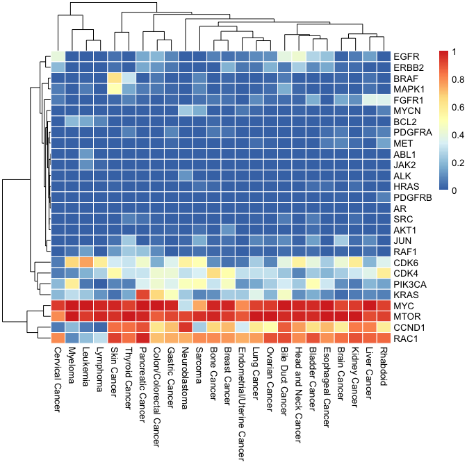
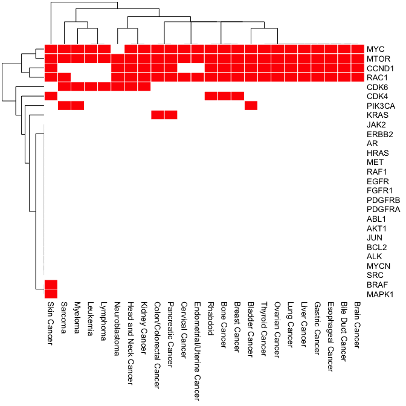
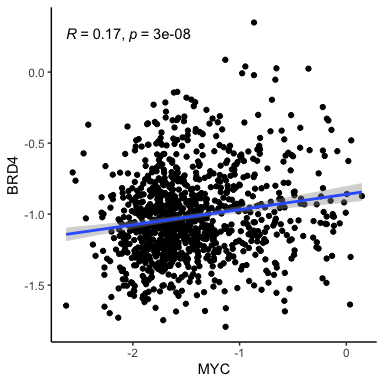
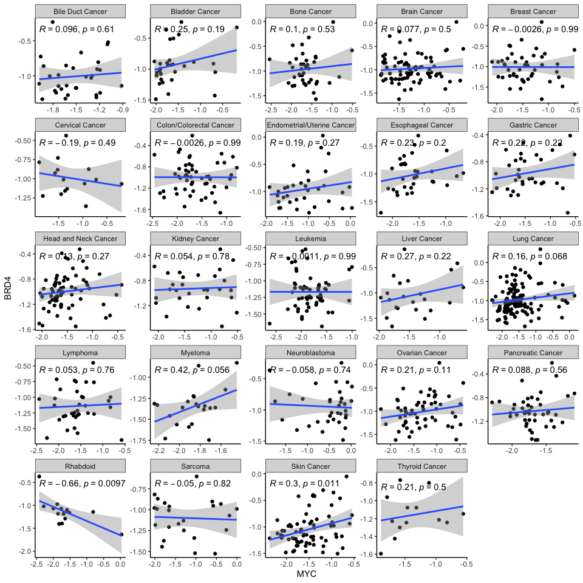
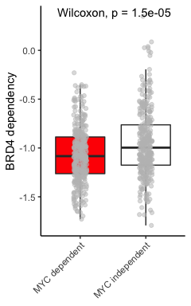
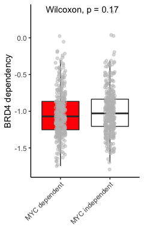
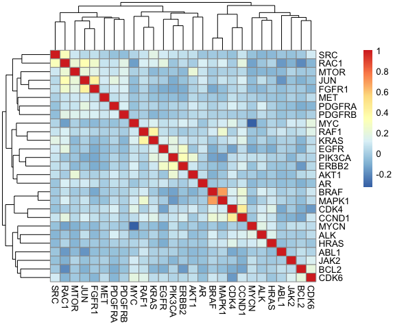
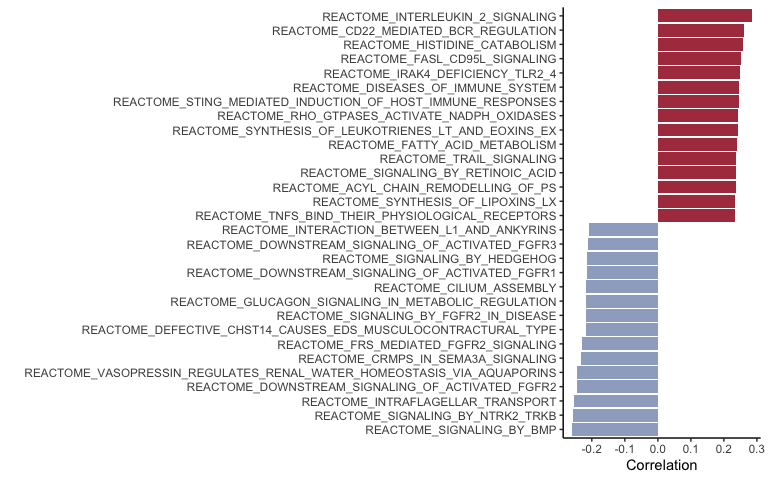

------------------------------------------------------------------------

All the data are organized as cell line in rows, genes/pathways in
columns. Here I used CRISPR screen dependency scores for most of the
analysis for illustration. It can be swapped to other data tables:

### Cell line & genes

ccle\_cn: copy number variations in CCLE ccle\_rnaseq: RNA expression in
CCLE ccle\_protein: Protein expression in CCLE drive\_rsa: RSA score in
project DRIVE (Robert et al, Cell, 2017) shrna\_d2: DEMETER2 score in
combined shRNA screens

### Cell line & pathways

gsva: gsva score calculated from ccle\_rnaseq

### data sources

drive\_rsa is a replicate analysis from the original paper (Robert et
al, Cell, 2017) gsva is calculated from gsva() from GSVA package from
Bioconductor

The rest of these data are downloaded from DepMap.org (22Q1) and are
pre-processed by data\_formmating.R

------------------------------------------------------------------------

1.  Tissue selective dependency heatmap

Given genes of interest (here using a list of oncogenes as examples),
plot the fraction of cell lines that have dependency score less than the
cutoff \*Can also plot tissue specific expression

    tissue_dep(genelist = oncogene_of_interest, data = crispr_chronos, dep_cutoff = -0.6)

Binary version of the previous plot, using an addition cutoff for
fraction. Given genes of interest (here using a list of oncogenes as
examples), plot the tissues that shows dependencies.

    tissue_dep_binary(genelist = oncogene_of_interest, data = crispr_chronos, dep_cutoff = -0.6, perc_cutoff = 0.5)

1.  Co-dependency/Correlation analysis

2.1 What genes are most co-dependent with c-MYC?

    cortable1 = single_cor(gene = "MYC", data1 = crispr_chronos, data2 = crispr_chronos, method = "pearson")
    cortable1[order(cortable1[,"pval"], decreasing = F),][1:10,]

    ##         gene        cor         pval         padj tissue_type    n
    ## 9344     MYC  1.0000000 0.000000e+00 0.000000e+00  Pan-cancer 1054
    ## 8620     MAX  0.3663691 7.924793e-35 6.889023e-31  Pan-cancer 1054
    ## 9348    MYCN -0.3332854 9.263071e-29 5.368258e-25  Pan-cancer 1054
    ## 6650  HNRNPM  0.3126152 2.509231e-25 1.090637e-21  Pan-cancer 1054
    ## 14625 TAMM41  0.3108788 4.740799e-25 1.648471e-21  Pan-cancer 1054
    ## 8735   MED27 -0.3083182 1.202167e-24 3.483480e-21  Pan-cancer 1054
    ## 8341    LSM6 -0.3001036 2.236928e-23 5.555889e-20  Pan-cancer 1054
    ## 12888   SCAP  0.2935106 2.185401e-22 4.749423e-19  Pan-cancer 1054
    ## 16603  YARS2  0.2891335 9.605675e-22 1.704387e-18  Pan-cancer 1054
    ## 10633  PDCL3 -0.2890728 9.803218e-22 1.704387e-18  Pan-cancer 1054

What genes are most correlated with c-MYC copy number?

    cortable1 = single_cor(gene = "MYC", data1 = ccle_cn, data2 = crispr_chronos, method = "pearson")
    cortable1[order(cortable1[,"pval"], decreasing = F),][1:10,]

    ##          gene        cor         pval         padj tissue_type    n
    ## 2584     CDK8 -0.1693073 3.663422e-08 0.0004064752  Pan-cancer 1045
    ## 9338    MYBL2 -0.1662021 6.519930e-08 0.0004064752  Pan-cancer 1045
    ## 9344      MYC -0.1645847 8.766276e-08 0.0004064752  Pan-cancer 1045
    ## 11062 PLEKHA1  0.1642294 9.351782e-08 0.0004064752  Pan-cancer 1045
    ## 1162    ATOH1 -0.1604704 1.837563e-07 0.0006389575  Pan-cancer 1045
    ## 9692  NEUROD1 -0.1522808 7.587888e-07 0.0021987170  Pan-cancer 1045
    ## 143      ACE2 -0.1490003 1.407255e-06 0.0034952191  Pan-cancer 1039
    ## 13526  SLC2A1 -0.1471457 1.779010e-06 0.0034957692  Pan-cancer 1045
    ## 9878    NOLC1  0.1470412 1.809612e-06 0.0034957692  Pan-cancer 1045
    ## 1488    BIRC6 -0.1457047 2.248047e-06 0.0039084547  Pan-cancer 1045

2.2 What genes are co-dependent with c-MYC with tissue selectivity?

    # calculate correlations within each tissue type
    cortable2 = single_cor(gene = "MYC", data1 = crispr_chronos, data2 = crispr_chronos, method = "pearson", split_tissue = T)

    # show top correlated genes in breast cancer
    subcor = subset(cortable2, tissue_type == "Breast Cancer")
    subcor[order(subcor[,"pval"], decreasing = F),][1:10,]

    ##          gene        cor         pval        padj   tissue_type  n
    ## 78888     MYC  1.0000000 0.000000e+00 0.000000000 Breast Cancer 45
    ## 69803  ADAM32 -0.6879467 1.774536e-07 0.001542604 Breast Cancer 45
    ## 77315    KRR1  0.6529067 1.168399e-06 0.005410035 Breast Cancer 45
    ## 85710    URB1  0.6516470 1.244688e-06 0.005410035 Breast Cancer 45
    ## 80818    POP5  0.6299440 3.541609e-06 0.012314882 Breast Cancer 45
    ## 80761    POLE -0.6218494 5.126499e-06 0.014854886 Breast Cancer 45
    ## 70094    ALG2  0.6092852 8.920101e-06 0.017942717 Breast Cancer 45
    ## 73534   DHX33  0.6086331 9.174299e-06 0.017942717 Breast Cancer 45
    ## 79418    NOL6  0.6053760 1.054692e-05 0.017942717 Breast Cancer 45
    ## 80900 PPP1R10 -0.6037951 1.127910e-05 0.017942717 Breast Cancer 45

What tissue types are most correlated between MYC and MYCN?

    subcor = subset(cortable2, gene == "MYCN")
    subcor[order(subcor[,"pval"], decreasing = F),][1:10,]

    ##        gene        cor         pval        padj                tissue_type   n
    ## 252752 MYCN -0.4089631 1.359604e-06 0.003939681                Lung Cancer 130
    ## 357068 MYCN -0.7610018 1.571841e-03 0.267921780                   Rhabdoid  14
    ## 183208 MYCN -0.3393305 4.642780e-03 0.279568782       Head and Neck Cancer  68
    ## 131050 MYCN -0.4242230 1.240327e-02 0.321633481 Endometrial/Uterine Cancer  34
    ## 374454 MYCN -0.4310350 3.547788e-02 0.765287758                    Sarcoma  24
    ## 9348   MYCN  0.3618729 4.545689e-02 0.909645378           Bile Duct Cancer  31
    ## 304910 MYCN -0.2911033 9.485715e-02 0.949747829              Neuroblastoma  34
    ## 61506  MYCN -0.1666296 1.448162e-01 0.915575024               Brain Cancer  78
    ## 339682 MYCN  0.2068520 1.678026e-01 0.759629572          Pancreatic Cancer  46
    ## 26734  MYCN  0.2571377 1.701410e-01 0.787768530             Bladder Cancer  30

1.  Visualizations of individual data or summarized data

3.1 Scatter plot pan cancer correlations (MYC dependency vs. BRD4
dependency)

    single_cor_plot("MYC", "BRD4", crispr_chronos, crispr_chronos, split_tissue = F)

    ## `geom_smooth()` using formula 'y ~ x'

3.2 Scatter plot split by tissue type (MYC dependency vs. BRD4
dependency)

    single_cor_plot("MYC", "BRD4", crispr_chronos, crispr_chronos, split_tissue = T)

    ## `geom_smooth()` using formula 'y ~ x'

3.3 box plot (MYC dependency vs. BRD4 dependency)

    single_box("MYC", "BRD4", crispr_chronos, crispr_chronos, cutoff = 0.33, abs = F)

3.3 box plot (MYC copy number vs. BRD4 dependency)

    single_box("MYC", "BRD4", ccle_cn, crispr_chronos, cutoff = 0.33, abs = F)

1.  What are the genes most correlated with my group of oncogenes?

<!-- -->

    cortable3 = group_cor(genelist = oncogene_of_interest, data1 = crispr_chronos, data2 = crispr_chronos, method = "pearson")
    data.frame(cortable3[order(rowMeans(cortable3), decreasing = T),][1:10,])

    ##                MYC        MYCN       MTOR        SRC           ALK        BCL2
    ## CCND1   0.04437236 -0.02747789 0.02970688 0.07950337  0.1282665913 -0.13460611
    ## RAF1    0.08561599 -0.03626076 0.03927827 0.06918353 -0.0434666918  0.05524262
    ## CRKL    0.05655351 -0.03183440 0.08549347 0.33492983  0.0837637829 -0.19748106
    ## NCKAP1 -0.11449397 -0.06350954 0.14773247 0.29237657  0.0007783265 -0.26478076
    ## SHOC2   0.02483828 -0.04416825 0.10683974 0.07500273 -0.0354862934  0.06473677
    ## RAC1   -0.15469955 -0.13732887 0.21764659 0.29355112 -0.0297547024 -0.21018009
    ## FOSL1   0.08331593 -0.15646817 0.14001442 0.08506447 -0.0510041052 -0.16784806
    ## PTK2   -0.12913931 -0.03782769 0.19970275 0.32033761  0.0493870260 -0.14090586
    ## ILK    -0.01803953 -0.14500144 0.14068710 0.32875232 -0.0206151782 -0.23520969
    ## DOCK5   0.10089826 -0.09309056 0.06889448 0.34502278 -0.0394348528 -0.10360403
    ##                CDK4         CDK6      CCND1        JUN      PIK3CA         AKT1
    ## CCND1   0.426995733  0.081553341 1.00000000 0.11814227  0.07557384 -0.018600550
    ## RAF1    0.006485635  0.148441870 0.11547538 0.06172856  0.01338973  0.012437427
    ## CRKL    0.074810664  0.023395659 0.24977857 0.18075651  0.09102516  0.017772101
    ## NCKAP1  0.001774844 -0.026835391 0.21117234 0.30861641  0.10541534  0.084202135
    ## SHOC2   0.004000425  0.055982608 0.07536018 0.21240062 -0.04175792  0.026078723
    ## RAC1   -0.003458414 -0.091287880 0.17633073 0.32115124 -0.03923435 -0.010414562
    ## FOSL1   0.034833273  0.005439125 0.24875119 0.56814570 -0.05361291 -0.025934072
    ## PTK2    0.077366811 -0.038726345 0.22303416 0.32955597 -0.09390711 -0.033747864
    ## ILK    -0.017263320 -0.068767237 0.21557479 0.27378542  0.03818121 -0.031441246
    ## DOCK5   0.031437168  0.080448696 0.19990853 0.13714409  0.07798905 -0.005492699
    ##               ABL1        BRAF      PDGFRA       PDGFRB      FGFR1        EGFR
    ## CCND1  -0.08101471 0.215984003 0.079713889 -0.004137405 0.06244670  0.04992920
    ## RAF1    0.08673398 0.106390506 0.026145889 -0.006628635 0.01592899  0.06125774
    ## CRKL   -0.16529233 0.136469687 0.105781140  0.108529759 0.06328739  0.20732875
    ## NCKAP1 -0.10042496 0.023733170 0.141260067  0.125997750 0.20808899  0.21564979
    ## SHOC2   0.04720945 0.018659465 0.047882556  0.069847666 0.19187451  0.08604578
    ## RAC1   -0.16381735 0.061635275 0.071552625  0.161962301 0.24311272  0.18109130
    ## FOSL1  -0.11503580 0.004219950 0.144028379  0.041105685 0.27779279  0.24816600
    ## PTK2   -0.18186024 0.150614690 0.102670306  0.142371943 0.26105419 -0.02448294
    ## ILK    -0.12690913 0.088147428 0.066904898  0.109535471 0.15113084  0.24916046
    ## DOCK5  -0.08680598 0.006524468 0.001622926 -0.030544441 0.11581303  0.25171511
    ##              RAF1         MET      RAC1      MAPK1       KRAS         HRAS
    ## CCND1  0.11547538 0.022075922 0.1763307 0.18140925 0.14842457  0.068174241
    ## RAF1   1.00000000 0.001056248 0.1072433 0.22708631 0.39673008  0.045159410
    ## CRKL   0.09168521 0.024579015 0.5199463 0.15877746 0.14871552  0.049336334
    ## NCKAP1 0.13586560 0.027318655 0.6165209 0.05782821 0.23303659 -0.038347016
    ## SHOC2  0.63908928 0.080392165 0.1961659 0.16993777 0.25864665  0.044598959
    ## RAC1   0.10724331 0.070719707 1.0000000 0.11520523 0.12386549  0.017325311
    ## FOSL1  0.18943642 0.112516430 0.3090720 0.12420739 0.18327772 -0.065009526
    ## PTK2   0.11693893 0.088201696 0.6054115 0.14601571 0.05278414  0.118437755
    ## ILK    0.10262353 0.073210921 0.6376126 0.11946213 0.18140082  0.003977919
    ## DOCK5  0.21015735 0.033973743 0.3833188 0.06876296 0.39757816 -0.028312162
    ##                AR       ERBB2          JAK2
    ## CCND1  0.07481101  0.13290324 -1.038343e-01
    ## RAF1   0.01665116 -0.02448012  3.058236e-02
    ## CRKL   0.04240426  0.21343105 -7.842849e-02
    ## NCKAP1 0.06646484  0.13710240 -6.573946e-02
    ## SHOC2  0.08704831 -0.07832011  5.152625e-02
    ## RAC1   0.11399587  0.04447742 -9.746206e-02
    ## FOSL1  0.09239577  0.10268780 -2.852752e-02
    ## PTK2   0.06007637 -0.02024901 -3.649099e-02
    ## ILK    0.11626110  0.13147932 -8.997965e-02
    ## DOCK5  0.02746685  0.06653410  8.262165e-05

1.  what are the most correlated genes within my group of oncogenes?

-   Here you can see nice correlation between BRAF and MAPK1, as well as
    CDK4 and CCND1

<!-- -->

    pheatmap(cortable3[oncogene_of_interest,])

6. what are the pathways that correlate with MYC dependency? Given a
gene of interest in a dataset, correlate it with gene expression
signatures (MSigDb) from CCLE RNAseq data.

    gsva_cor("MYC", crispr_chronos, subset = "REACTOME", n = 15)

    sessionInfo()

    ## R version 4.0.5 (2021-03-31)
    ## Platform: x86_64-apple-darwin17.0 (64-bit)
    ## Running under: macOS Big Sur 10.16
    ## 
    ## Matrix products: default
    ## BLAS:   /Library/Frameworks/R.framework/Versions/4.0/Resources/lib/libRblas.dylib
    ## LAPACK: /Library/Frameworks/R.framework/Versions/4.0/Resources/lib/libRlapack.dylib
    ## 
    ## locale:
    ## [1] en_US.UTF-8/en_US.UTF-8/en_US.UTF-8/C/en_US.UTF-8/en_US.UTF-8
    ## 
    ## attached base packages:
    ## [1] stats     graphics  grDevices utils     datasets  methods   base     
    ## 
    ## other attached packages:
    ## [1] pheatmap_1.0.12 ggpubr_0.4.0    ggplot2_3.3.5  
    ## 
    ## loaded via a namespace (and not attached):
    ##  [1] tidyselect_1.1.2   xfun_0.29          purrr_0.3.4        splines_4.0.5     
    ##  [5] lattice_0.20-45    carData_3.0-5      colorspace_2.0-3   vctrs_0.3.8       
    ##  [9] generics_0.1.2     htmltools_0.5.2    yaml_2.3.5         mgcv_1.8-39       
    ## [13] utf8_1.2.2         rlang_1.0.1        pillar_1.7.0       glue_1.6.2        
    ## [17] withr_2.4.3        DBI_1.1.2          RColorBrewer_1.1-2 lifecycle_1.0.1   
    ## [21] stringr_1.4.0      munsell_0.5.0      ggsignif_0.6.3     gtable_0.3.0      
    ## [25] evaluate_0.15      labeling_0.4.2     knitr_1.37         fastmap_1.1.0     
    ## [29] fansi_1.0.2        highr_0.9          broom_0.7.12       scales_1.1.1      
    ## [33] backports_1.4.1    abind_1.4-5        farver_2.1.0       digest_0.6.29     
    ## [37] stringi_1.7.6      rstatix_0.7.0      dplyr_1.0.8        grid_4.0.5        
    ## [41] cli_3.2.0          tools_4.0.5        magrittr_2.0.2     tibble_3.1.6      
    ## [45] crayon_1.5.0       tidyr_1.2.0        car_3.0-12         pkgconfig_2.0.3   
    ## [49] Matrix_1.4-0       ellipsis_0.3.2     assertthat_0.2.1   rmarkdown_2.11    
    ## [53] rstudioapi_0.13    R6_2.5.1           nlme_3.1-155       compiler_4.0.5
